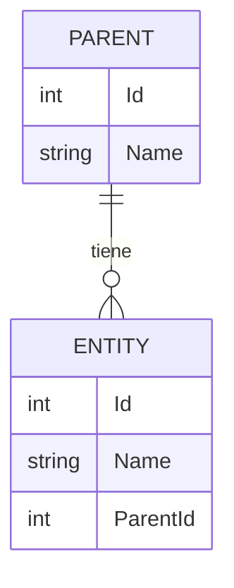

# Modelo de dominio

<!-- IA: fuente de verdad de QUÉ entidades existen y cómo se relacionan (lenguaje de negocio + tipos).
El esquema físico exacto sale de las migraciones; aquí no se copian columnas técnicas (auditoría, RowVersion, IsDeleted),
que vienen de BaseEntity. Lo llena product-analyst con database-architect. new-entity lo lee antes de crear código. -->

## Entidades

| Entidad | Módulo | Descripción | PK | Soft delete |
|---|---|---|---|---|
| {{Entity}} | {{Modulo}} | {{Qué representa en el negocio}} | {{int}} | {{Sí}} |

## Detalle por entidad

### {{Entity}}
| Propiedad | Tipo C# | Requerida | Reglas |
|---|---|---|---|
| {{Name}} | `string` (máx. {{200}}) | Sí | {{Única entre activos / formato / rango}} |
| {{Status}} | `{{Entity}}Status` (enum) | Sí | {{Valores: Draft, Active, Closed}} |
| {{ParentId}} | `int` (FK → {{Parent}}) | Sí | {{Debe existir y estar activo}} |

**Invariantes** (siempre verdaderas):
- {{Ej.: el total es la suma de las líneas.}}
- {{Ej.: solo un registro puede tener IsPrimary = true por cliente.}}

**Ciclo de vida:** {{estados y transiciones permitidas, o "ver 06-business-workflows.md".}}

## Relaciones

| Origen | Relación | Destino | Al eliminar el destino |
|---|---|---|---|
| {{Entity}} | N:1 | {{Parent}} | {{Restrict (no se puede eliminar si tiene hijos)}} |

## Diagrama

<!-- IA: reemplazar PARENT/ENTITY por los nombres reales. Mantener el diagrama sincronizado con las tablas de arriba. -->

## Enums

| Enum | Valores | Uso |
|---|---|---|
| `{{Entity}}Status` | {{Draft, Active, Closed}} | {{Estado del ...}} |
