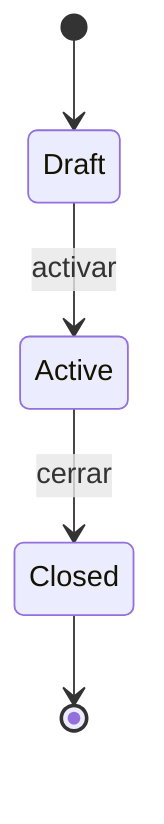

# Flujos de negocio

<!-- IA: procesos de negocio de varios pasos o con estados. Un bloque por flujo. Sirve para implementar transiciones
válidas en los services (reglas → {Entity}Errors) y para los tests. Solo flujos reales del negocio; no documentar CRUD simple. -->

## Índice
| Flujo | Módulo(s) | Actores |
|---|---|---|
| WF-01 {{Nombre del flujo}} | {{Modulo}} | {{Actor}} |

---

## WF-01 — {{Nombre del flujo}}

**Objetivo:** {{Qué logra el negocio con este flujo.}}
**Disparador:** {{Qué lo inicia: acción de un actor, fecha, evento externo.}}
**Requerimientos:** {{BR-001, FR-MOD-003}}

### Pasos
1. {{Actor}} {{hace ...}} → `{{POST /api/...}}`
2. El sistema {{valida ... / cambia el estado a ... / notifica ...}}
3. {{...}}

### Estados

| Desde | Acción | Hacia | Quién puede | Condición | Error si no se cumple |
|---|---|---|---|---|---|
| Draft | activar | Active | {{permiso}} | {{datos completos}} | `{{Entity}}.CannotActivate` |

### Casos alternos y errores
- {{Si ..., entonces ...}}

### Efectos secundarios
- {{Emails, eventos, jobs que dispara (detallar en 08-integrations-events-jobs.md).}}
